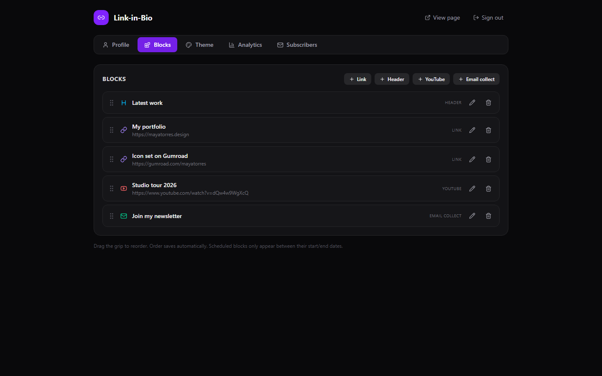

# 🔗 Link-in-Bio

[](LICENSE)

**Your one page on your own domain. Pay once. Own it forever. No subscription.**

A self-hosted link-in-bio page builder — everything Linktree charges $5–$9/month for, running on your own $5 VPS (or your desktop) with **zero third-party branding**, your analytics staying **your** data, and your email list living in **your** database.



## ☕ Skip the setup — get the 1-click installer

Don't want to touch a terminal? Grab the packaged installer (Windows desktop app + guided VPS deploy) here:

**→ [https://whop.com/onetime-suite](https://whop.com/onetime-suite)** — one-time purchase, lifetime updates.

## Features

- **Profile** — avatar upload, display name, bio, social icon row for 12 networks (Instagram, X, TikTok, YouTube, Facebook, LinkedIn, GitHub, Twitch, Spotify, Pinterest, Threads, Website)
- **Blocks** — links (with optional thumbnail + hover animation), header/dividers, embedded YouTube, and **email-collect blocks** that store subscribers in SQLite with one-click CSV export
- **Drag to reorder** — grab the grip, drop, done; order saves automatically
- **Scheduling** — give any block a start/end date (launch-day links, limited drops)
- **6 polished themes** — gradient, glass, minimal light, dark, neon, paper — plus custom accent color, custom background (color / CSS gradient / image upload), and a custom CSS box for full control
- **Font picker** — 8 curated stacks, fully self-hosted: the public page makes **zero external requests** (no Google Fonts pings, no trackers)
- **Analytics** — page views, clicks per link, CTR, 30-day chart. Yours. Not sold to anyone.
- **Fast public page** — server-rendered HTML at `/`, mobile-first, SEO meta + Open Graph tags
- **100% local & private** — one SQLite file, no telemetry, no external services

## Quick start

```bash
npm i
npm run build   # builds the admin UI
npm start       # → http://localhost:5307
```

- **Public page:** `http://localhost:5307/`
- **Admin panel:** `http://localhost:5307/admin` (default password `admin` — change via `ADMIN_PASSWORD`)

### Desktop mode

Run it as a desktop app, or deploy to a $5 VPS when you need it public:

```bash
npm run desktop   # Electron window, auto-logged-in, data stored per-user
```

`npm run dist` packages a Windows installer (NSIS) via electron-builder.

### Docker (VPS deploy)

```bash
cp .env.example .env   # set ADMIN_PASSWORD!
docker compose up -d   # persists SQLite + uploads in a named volume
```

Point your domain at the box, put Caddy/nginx/Traefik in front for TLS, done — `yourname.com` is your link-in-bio.

## Link-in-Bio vs Linktree

| | **Link-in-Bio (this)** | Linktree |
|---|---|---|
| Price | **$19 once** | $5–$9/mo, forever |
| Your own domain | ✅ Yes, natively | Paid plan only |
| "Linktree" branding on your page | **None** | On free plan |
| Email capture + CSV export | ✅ Built in | Paid plan |
| Link scheduling | ✅ Built in | Paid plan |
| Analytics | ✅ Yours, in your SQLite | Theirs, on their servers |
| Custom CSS | ✅ | ❌ |
| Themes | 6 presets + full custom | Limited on free |
| Your data if they shut down / ban you | **Always yours** | Gone |
| Cost over 3 years | **$19** | $180–$324 |

## Tech stack

- **Server:** Node 20+, Express, better-sqlite3 (WAL) — single process serves API + admin + public page
- **Admin UI:** React 18, Vite, Tailwind CSS 4, Framer Motion (drag-to-reorder, transitions), Lucide icons
- **Public page:** server-rendered plain HTML/CSS — no framework payload, loads instantly on mobile
- **Desktop:** thin Electron wrapper reusing the exact same server on a free local port
- **Storage:** one SQLite file + an uploads folder. Back up = copy two things.

## Configuration

| Env var | Default | Purpose |
|---|---|---|
| `PORT` | `5307` | Server port |
| `ADMIN_PASSWORD` | `admin` | Admin panel password |
| `DATA_DIR` | `./data` | SQLite db + uploaded images |

## Development

```bash
npm start        # API + public page on :5307
npm run dev      # Vite dev server for the admin UI on :5308 (proxies /api)
npm test         # end-to-end smoke test against a throwaway db
```

## License

MIT © 2026 Ben ([bensblueprints](https://github.com/bensblueprints))
